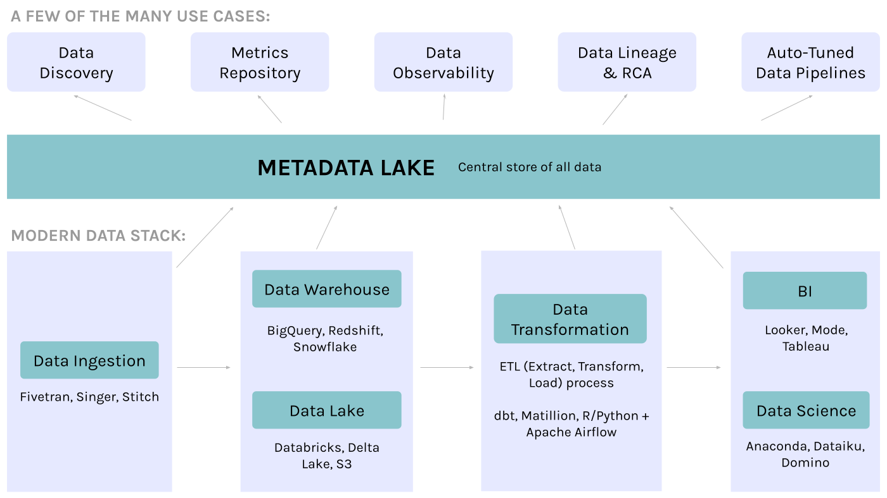

Metadata, metadatalake, Modern Metadata Stack (MMS)
===================================================

# Table of Content (ToC)
* [Metadata, metadatalake, Modern Metadata Stack (MMS)](#metadata-metadatalake-modern-metadata-stack-mms)
* [Overview](#overview)
* [References](#references)
* [Introduction](#introduction)
* [Frameworks](#frameworks)
  * [DataHub](#datahub)
  * [Open Metadata](#open-metadata)
  * [Marquez](#marquez)
  * [OpenLineage](#openlineage)
  * [Open Data Discovery (ODD) Spec](#open-data-discovery-odd-spec)
  * [Amundsen](#amundsen)
  * [Egeria](#egeria)
  * [Databook](#databook)
  * [Nemo](#nemo)
  * [Dataportal](#dataportal)
  * [Metacat](#metacat)
  * [Hive Metastore](#hive-metastore)
* [Tools](#tools)
  * [SQL parsers](#sql-parsers)
    * [GitSchemas](#gitschemas)

Created by [gh-md-toc](https://github.com/ekalinin/github-markdown-toc.go)

# Overview
[This project](https://github.com/data-engineering-helpers/metadata)
intends to collect, analyze and synthetize referential material
about metadata, in order to facilitate the implementing of metadatalakes.
That is, this project is a first contribution to a
Modern Metadatalake Stack (MMS), much like the initiatives around the rise
of the Modern Data Stack (MDS).

Even though the members of the GitHub organization may be employed by
some companies, they speak on their personal behalf and do not represent
these companies.

# References
* The Rise of the Metadata Lake,
  [Prukalpa](https://prukalpa.medium.com/), Jun. 2021:
  https://towardsdatascience.com/the-rise-of-the-metadata-lake-1e95127594de
* The anatomy of an active metadata platform,
  [Prukalpa](https://prukalpa.medium.com/), Aug. 2021:
  https://towardsdatascience.com/the-anatomy-of-an-active-metadata-platform-13473091ad0d
* DataHub: A generalized metadata search & discovery tool, Mars Lan, Aug. 2019:
  https://engineering.linkedin.com/blog/2019/data-hub
* [Material for the Data platform - Data-lakes, data warehouses, data lake-houses](https://github.com/data-engineering-helpers/data-lakehouse)
* [Material for the Data platform - Data contracts](https://github.com/data-engineering-helpers/data-contracts)
* [Material for the Data platform - Data quality](https://github.com/data-engineering-helpers/data-quality/blob/main/README.md)
* [Material for the Data platform - Modern Data Stack (MDS) in a box](https://github.com/data-engineering-helpers/mds-in-a-box/blob/main/README.md)
* [Architecture principles for data engineering pipelines on the Modern Data Stack (MDS)](https://github.com/data-engineering-helpers/architecture-principles)
  + [Material for the Data platform - Architecture principles](https://github.com/data-engineering-helpers/architecture-principles/blob/main/material/README.md)
* Specifications/principles for a
  [data engineering pipeline deployment tool](https://github.com/data-engineering-helpers/data-pipeline-deployment)

# Introduction
In the past 10 years, as the modern data stack has matured and become
mainstream, we’ve taken great leaps forward in data infrastructure.
However, the modern data stack still has one key missing component:
context. That’s where metadata comes in. In this increasingly diverse
data world, metadata holds the key to the elusive promised land — a single
source of truth. There will always be countless tools and tech in
a team’s data infrastructure. By effectively collecting metadata,
a team can finally unify context about all their tools, processes, and data.

But what actually is metadata, you ask? Simply put, metadata is
“data about data”.

Today, metadata is everywhere. Every component of the modern data stack
and every user interaction on it generates metadata. Apart from
traditional forms like technical metadata (e.g. schemas) and business
metadata (e.g. taxonomy, glossary), our data systems now create entirely
new forms of metadata.

Cloud compute ecosystems and orchestration engines generate
logs every second, called performance metadata.
Users who interact with data assets and one another generate social metadata.
Logs from BI tools, notebooks, and other applications, as well as
from communication tools like Slack, generate usage metadata.
Orchestration engines and raw code (e.g. SQL) used to create data assets
generate provenance metadata.

# Frameworks

## DataHub
* Moto: "A Metadata Platform for the Modern Data Stack"

* GitHub: https://github.com/linkedin/datahub
* Company behind: LinkedIn
* Open source: yes

DataHub is an open-source metadata platform for the modern data stack.
Read about the architectures of different metadata systems and
[why DataHub excels](https://engineering.linkedin.com/blog/2020/datahub-popular-metadata-architectures-explained).
Also read
[the LinkedIn Engineering blog post](https://engineering.linkedin.com/blog/2019/data-hub),
check out
[the Strata presentation](https://speakerdeck.com/shirshanka/the-evolution-of-metadata-linkedins-journey-strata-nyc-2019)
and watch
[the Crunch Conference Talk](https://www.youtube.com/watch?v=OB-O0Y6OYDE).
You should also visit
[DataHub Architecture](https://github.com/linkedin/datahub/blob/master/docs/architecture/architecture.md)
to get a better understanding of how DataHub is implemented and
[DataHub Onboarding Guide](https://github.com/linkedin/datahub/blob/master/docs/modeling/extending-the-metadata-model.md)
to understand how to extend DataHub for your own use cases.

## Open Metadata
* Moto: "A Single place to Discover, Collaborate, and Get your data right"

* Home page: https://open-metadata.org/
* GitHub: https://github.com/open-metadata/OpenMetadata
* Organization behind: former employees of Uber and Hortonworks
* Open source: yes

## Marquez
* GitHub: https://github.com/MarquezProject/marquez
* Organization behind: [WeWork](https://www.wework.com/) / Datakin
* Open source: yes

Marquez is an open source metadata service for the collection, aggregation,
and visualization of a data ecosystem's metadata, going together
with OpenLineage (see below). It maintains the provenance of how datasets
are consumed and produced, provides global visibility into job runtime
and frequency of dataset access, centralization of dataset lifecycle
management, and much more. Marquez was released and open sourced by
[WeWork](https://www.wework.com/).

## OpenLineage
* Home page: http://openlineage.io/
* GitHub: https://github.com/OpenLineage/OpenLineage
* Organization behind: WeWork / Datakin
* Open source: yes

OpenLineage is an open standard for metadata and lineage collection designed
to instrument jobs as they are running. OpenLineage is the ground standard
for Marquez (see above). It defines a generic model of run, job,
and dataset entities identified using consistent naming strategies.
The core lineage model is extensible by defining specific facets
to enrich those entities.

## Open Data Discovery (ODD) Spec
* GitHub: https://github.com/opendatadiscovery/opendatadiscovery-specification
* Open standard: yes

Open Data Discovery Specification (ODD Spec): A Universal Standard for
Metadata Collection

## Amundsen
* GitHub: https://github.com/amundsen-io/amundsen
* Company behind: Lyft
* Open source: yes

Amundsen is a data discovery and metadata engine for improving
the productivity of data analysts, data scientists and engineers
when interacting with data. It does that today by indexing data
resources (tables, dashboards, streams, etc.) and powering a page-rank
style search based on usage patterns (e.g. highly queried tables show up
earlier than less queried tables). Think of it as Google search for data.
The project is named after Norwegian explorer
[Roald Amundsen](https://en.wikipedia.org/wiki/Roald_Amundsen),
the first person to discover the South Pole.

## Egeria
* Moto: "Open metadata and governance for enterprises - automatically
capturing, managing and exchanging metadata between tools and platforms,
no matter the vendor"

* Organization behind it: Linux foundation
* Home page: https://odpi.github.io/egeria-docs/
* GitHub: https://github.com/odpi/egeria
* Open source: yes

## Databook
* Moto: "Turning Big Data into Knowledge with Metadata at Uber"

* Uber: https://eng.uber.com/databook/
* Company behind: Uber
* Open source: no

Like many technologies at Uber, they Databook is well described in articles,
but has not been open sourced so far.

## Nemo
* Moto: "Data discovery at Facebook"

* Facebook: https://engineering.fb.com/2020/10/09/data-infrastructure/nemo/
* Company behind: Facebook
* Open source: no

## Dataportal
* Moto: "Democratizing Data at Airbnb"

* Medium:
  https://medium.com/airbnb-engineering/democratizing-data-at-airbnb-852d76c51770
* Company behind: Airbnb
* Open source: no

## Metacat
* Moto: "Making Big Data Discoverable and Meaningful at Netflix"

* Medium: https://netflixtechblog.com/metacat-making-big-data-discoverable-and-meaningful-at-netflix-56fb36a53520
* Company behind: Netflix
* Open source: ?

## Hive Metastore
* Moto:
* 

# Tools

## SQL parsers

### GitSchemas
* GitHub/home page: https://github.com/tdoehmen/gitschemas
* That project features scripts to crawl SQL-files from GitHub, parse them and extract
 structured database schema information from them. The goal is to learn about the semantics
 of database tables in the wild (table names, column names, foreign key relations etc.)

